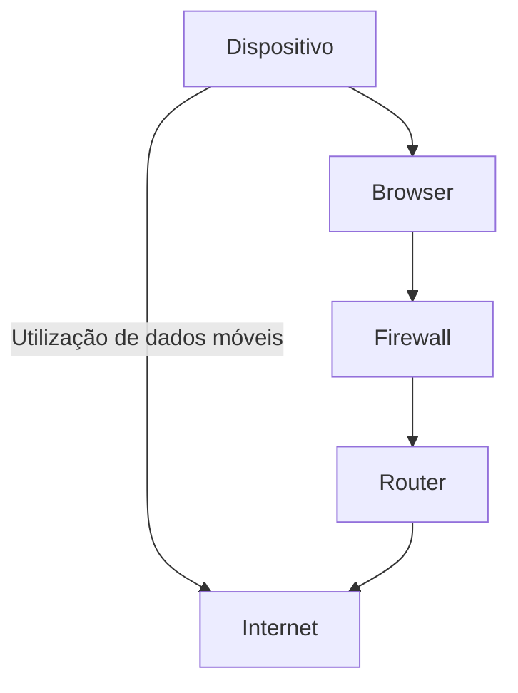

# Índice 

- [[#Introdução]]
- [[#Nível de ameaça]]
- [[#Recomendações basilares]]
- [[#Principais preocupações]]
	- [[#Email]]
	- [[#Passwords e verificação de 2 etapas]]
	- [[#Telemóvel]]
		- [[#Número de telemóvel]]
		- [[#Smartphones ]]
	- [[#Em quem confiar]]
	- [[#Encomendas - Compras online]]
	- [[#Redes sociais]]
	- [[#Inteligência Artificial]]
- [[#Aplicações de comunicação online]]
- [[#Internet]]
	- [[#Em casa]]
	- [[#Dados móveis]]
	- [[#Hotspots]]
	- [[#Firewalls]]
- [[#Computadores]]
- [[# Engenharia social]]
	- [[#Phishing]]
	- [[#Formulários e websites]]
	- [[#Chamadas telefónicas]]
- [[#Códigos QR e outros formatos]]
- [[#Sistema bancário]]
- [[#Fotografias e metadados]]
- [[#Dispositivos Inteligentes - Internet das Coisas (IoT)]]
- [[#Browsers]]
- [[#VPNs]]
- [[#Conclusão]]
	- [[#Recursos adicionais]]

---
# Introduction

The world is becoming increasingly interconnected and online. For those who need or want to ensure their privacy and security, neglecting the digital world is not an option. However, maintaining the desired level of security and privacy is a constant process of deciding between retaining the functionalities and automations of certain services or, conversely, performing some manual procedures and not having access to the same features that some people have. Cybersecurity is an evolving field and an important frontier for obtaining freedom, privacy, and personal security.

In this article, we will discuss different important aspects of cybersecurity. We will point out the dangers involved with certain technologies and how they can be used for malicious purposes. We will also cover how to prevent these same technologies from being used to harm us or those close to us.

The target audience of this article is victims of domestic violence who wish to escape their abusers or who have already escaped and want to keep their whereabouts unknown. However, the vast majority of the population will benefit from the knowledge shared in this article.

It is difficult to say in what order these cybersecurity concerns should be addressed, but the article is structured so that the order in which it is written follows a certain technical logic.

Note to the Reader
In a previous edition of this article, there were mentions of specific tools and techniques used to find people or information about them to demonstrate how easy it was to perform these discovery acts. However, considering the theme of this article and its exposure, those references have been removed so as not to provide information to a potential abuser who may come across the article.

> [!Info] O autor
> 
> The author works in the field of cybersecurity and has written the article in such a way that anyone who implements the main practices suggested here will be able to "disappear" online and hide from at least 95% of the people who might want to cause them harm.
> Additionally this projects is a community effort, in which people from the cybersecurity area and victim support organizations contribute to this project.

# Threat Level

In cybersecurity, it is common to define  [threat models](https://www.privacyguides.org/en/basics/threat-modeling/) to try to analyze what is most important to protect and our personal attack surface. This is because it is impossible to maintain complete anonymity and ensure privacy and security at all times. If someone were to attempt to do so, they would certainly spend all their time in this constant activity of analysis and response to threats that, realistically, would be infinitesimal.

To create a security model and determine the threat level we are facing, it is necessary to answer these questions:

1. **What do I want to protect?**
	1. My physical and mental well-being
	2. My family
2. **From whom do I want to protect it?**
	1. Abusers
3. **How likely is it that I will actually need to protect what I decided to protect?**
	1. Since anyone, with more or less effort, can use tools available to the masses, it is almost certain that the need is high. We do not want to make assumptions about an abuser's willingness or capability. We should try to prevent and make it difficult for anyone who wants to harm us so that they either give up or fail.
4. **What will be the consequences if I fail to protect it?**
	1. Physical or mental violence
	2. Theft
	3. Death or kidnapping
5. **How much effort am I willing to put in to prevent these possible consequences?**
	1. This is usually the most difficult question to answer, especially when a person does not have enough prior knowledge of the area to understand the effort that a decision might require.
	2. Considering the difficulty in finding or harming someone who follows the basic recommendations, we will work in this article on the assumption that the initial effort needed and some ongoing care and attention is all the effort the reader is willing to make.

> [!Warning] Self determination
The author of this article makes some assumptions about the dangers the reader may face, which may not apply to the reader's specific situation. It is important for each person to consider their own threat model, and with the knowledge they have and will acquire from this article, create their own model.

# Basic Recommendations

Nowadays, in countries with a minimum level of technological advancement, people's lives revolve around two main technologies: Cell Phones and Email. By taking some precautions and making a few changes, most people can "disappear."

If you do nothing else beyond what is indicated in this article, the minimum should be:

- Change your cell phone;
- Separate phone and internet accounts from those of the abuser if they are currently combined when the victim is attempting to escape;
- Change your phone number;
- Create a completely new email address without any personal information, for example:
	- 123bi45@gmail.com (without using the old number or email as account recovery factors);
- Delete the old email or at least remove all emails from the mailbox;
- Block the abuser and anyone you do not trust on social media;
- Make social media accounts private so they are not open to the public;
- Change passwords, phone numbers, and emails on all online services to the new versions;
- Use a password manager like[Bitwarden](https://bitwarden.com/)(recommended) or [LastPass](https://www.lastpass.com/pt) to create strong passwords (multiple characters with symbols and numbers) and store them.


> [!note] Note
> This article will cover all the topics mentioned in the basic recommendations, explaining why they are necessary, as much as possible, without providing tools to abusers. Additionally, there are some personal protection/privacy tools mentioned throughout the article.

# Main Concerns

As mentioned earlier, in the 21st century in technologically advanced countries, it is almost impossible to live without a cell phone and email. An email is needed for public financial services, for the bank, for communication with water and electricity providers, and the same applies to cell phones. Considering how easy it is to obtain personal information, including a person’s real-time location, these technologies will be our primary concern.

> [!Warning] Attention  
> We are trying our best not to share more information than necessary. The victim's (reader's) computer or cell phone may be compromised, and the abuser may know everything the victim does on the device. If the reader suspects or knows that someone causing them harm has even a basic level of technological knowledge, the author recommends formatting their computer and/or cell phone before following the steps outlined in this article. Instructions can be found here:
>
> - Format a MacOS computer: [Link](https://support.apple.com/en-us/102664)  
> - Format a Windows computer: [Link](https://support.microsoft.com/en-us/windows/give-your-pc-a-fresh-start-0ef73740-b927-549b-b7c9-e6f2b48d275e)  
> - Format an iPhone: [Link](https://support.apple.com/en-us/108931)  
> - Format an Android: [Link](https://support.google.com/android/answer/6088915?hl=en)  
>  
> When formatting, make sure to perform a full wipe, which means not leaving any applications installed or any photos. Absolutely nothing should remain; the computer or cell phone should be returned to its factory settings as if it had just come out of the box.


## Email

Email is something that is easy to handle and resolve; however, depending on the number of accounts associated with the emails that the reader might have, changing the email associated with these accounts to a new one can be a tedious and time-consuming task.  
The author suggests changing the passwords of the currently used emails to new versions, and **only after this step**, creating a new email account with any email service the reader prefers, such as [Gmail](https://www.google.com/intl/en/gmail/about/), [Outlook](https://www.microsoft.com/en-us/microsoft-365/outlook/email-and-calendar-software-microsoft-outlook), or the most secure and private of these options: [ProtonMail](https://proton.me/mail).

The new email should be something generic that does not reveal any information about us, for example: 123bi45@gmail.com.

After creating the new email, the author recommends installing and using a password manager to store and generate new passwords. You should never store access credentials on paper, in a text document on your computer, or in a service like the Google Chrome or Firefox password manager.

## Passwords and Two-Step Verification

The easiest way to remember passwords is not to have to memorize them at all. There are incredibly secure tools that take care of everything for us, such as [Bitwarden](https://bitwarden.com/help/getting-started-webvault/) (free and very reliable).

After creating a new email, it is recommended to create an account on Bitwarden and start using it to generate passwords, which can then be used for account registration or updating existing accounts.  

![[bitwarden.png| 250]]

If the reader decides to use Bitwarden as a [browser plug-in](https://bitwarden.com/help/getting-started-browserext/) (image above), it will simplify their life, as it detects when login credentials (username and password) are being entered and will ask the user if they want to save this information in the Bitwarden vault, to which you should indicate "yes":

![[bitwarden_credential_storage.png]]

Additionally, **it is highly recommended that the reader enable two-step authentication on all services that allow it.** [Two-step authentication](https://www.microsoft.com/en-us/security/business/security-101/what-is-two-factor-authentication-2fa) is simply a way to verify that the person using a service is indeed the account owner.  
**For example:** When logging into Gmail on a new device (such as a cell phone), a message will be sent to the account owner's number to authorize the login, proving that it is the owner attempting to log in.

It is possible to perform two-step authentication using a cell phone number by receiving messages with a code to be entered into the service. However, the author recommends using applications designed specifically for this purpose, such as [Authy](https://authy.com/), since [cell phone numbers can be hijacked](https://www.incognia.com/the-authentication-reference/what-is-sim-swap-attack-and-why-fast-detection-is-important), and SMS messages are not encrypted, making them easier to read without needing any credentials.

## Cell Phone

**The cell phone should always be replaced if there are financial means to do so.**  

There are many ways to track a cell phone without the owner realizing it.  
There are online services and unique identifiers that allow cell phones to be located—details the author will not specify or share. These features and similar applications can be activated without the cell phone user’s knowledge, so it is always better to replace the cell phone. If it is not possible to replace the cell phone, it should be formatted as previously indicated at the beginning of the section: [[#Main Concerns]].


> [!tip] New Cell Phones and SIM Cards  
> If possible, it is preferable to purchase a new cell phone and/or SIM card with cash, rather than through a digital transaction, to prevent it from being tracked and the IMEI of the new phone from being discovered.  
> If the reader visits a cell phone store, they can easily find a very inexpensive phone for less than €50, and the same applies to a SIM card. Additionally, it is essential to communicate with the phone carrier and set up a mandatory security question (for example, "What is the name of my neighbor's dog from high school?") to request a new physical SIM card.  

### Phone Number

There are tools that allow searching for social media accounts and many other platforms using phone numbers, which, unfortunately, are often required to create an account for online services.  
If the phone number is known by someone with malicious intentions toward us or those close to us, it can also be used as a constant source of harassment, such as making repeated phone calls, registering our number on services we do not use, and many other disruptive methods.  

**It is recommended that for our final phone number, we create a new account with a phone carrier using an email address that the abuser does not know about, and that this number is only shared with people who are 100% trustworthy.** If possible, use a virtual SIM card ([eSIM](https://www.vodafone.pt/telemoveis/esim.html)), as this would eliminate the need to wait for a card to be delivered by mail or to pick it up in person, thus reducing exposure.  

### Smartphones

Smartphones are incredibly useful tools with features like GPS, internet access, and photography. However, these features can also be used against us if we are not careful. It is entirely possible to use a smartphone while maintaining a good level of privacy and anonymity by following the guidelines provided in this article. If the reader has sufficient technical knowledge or is willing to experiment, they may consider using more secure operating systems on their smartphone. For a list of these operating systems and instructions on how to install them, see [here](https://www.privacyguides.org/en/android/).

The author of this article does not recommend changing the smartphone's operating system for everyone. However, if someone feels the need for extra protection and is concerned about using services like GPS or the internet, the easiest and most recommended option would be to purchase a phone without these capabilities, such as:

![[nokia_phone.png#center|256]]

Generally, a cell phone that costs less than €50 will not have GPS capabilities. [Inexpensive Nokia phones](https://www.hmd.com/pt_pt/nokia-105?sku=1GF019CPA2L12) are usually a great option.

> [!note] Note  
> More resources on privacy and security for iPhones and Androids can be found here: [Link](https://www.youtube.com/watch?v=mzI0s7G6yJE)  

## Who to Trust

==The sad reality is that trusting someone will always carry a risk of negative outcomes, not necessarily due to malice but often due to carelessness.==  
Imagine a situation where you take a picture of the view from your window and share it with someone via WhatsApp. There are situations where that photo could end up in the hands of a predator/abuser, either through accidental sharing with third parties or if the person you shared the photo with has spyware on their phone that automatically forwards messages to the abuser. There are dozens of ways to access information on another person’s phone.  
Additionally, the image might contain [metadata](https://www.metadados.pt/oquesaometadados/) with latitude and longitude, revealing the exact location where the photo was taken. This often happens when a person has GPS enabled at the time of taking the photo and has never bothered to block this feature on their phone. Moreover, the image itself can contain visual information that can easily indicate our location.

==**Conclusion**:== We can and should trust people. We are social beings who need to communicate and thrive largely because of our life in society. However, we can and should also be cautious, which realistically means not sharing unnecessary information and being aware of the information we share when we do share it. This can include photos, videos, voice messages, and even what we say.

> [!info] Automation  
> This article introduces some tools that simplify life and enhance our security and privacy, such as [[#VPNs]] and password managers. Tools like these and others reduce the risk of accidentally sharing dangerous information.  

## Shipping - Online Shopping

It is recommended not to have packages delivered to your home address, but rather to a package pickup point. This way, you do not need to share your address with other people or services that you do not control, and you can pick up the packages whenever you feel it is safest and most convenient.  

## Social Media

For those looking to investigate people and obtain private information, social media is a goldmine. It is genuinely easy to find a person’s location and other information through social media.

**The author asks the reader to trust the above statement**. As previously mentioned, there were techniques and tools shared in this document that demonstrated how easy this was, however, they have been removed due to security concerns.

With this in mind, the reader can follow some of these steps, depending on their threat model, to reduce their online exposure:
1. Delete all social media accounts  
	1. This is an extreme step and depends on the reader's level of concern. However, it is worth noting that it is entirely possible to have social media accounts, especially if you create a new account and follow the remaining advice.
2. Make profiles private and/or choose who you want to allow to interact with your social media accounts.  
	1. Make [Instagram private](https://help.instagram.com/448523408565555)  
	2. Make [Facebook private](https://www.facebook.com/help/193677450678703)  
	3. Make [Twitter private](https://statusbrew.com/insights/how-to-make-twitter-account-private/)  
	4. Almost all social media platforms have tools that allow you to limit who can view and interact with your accounts; it's just a matter of searching online (Google or Bing) to find out how.
3. Do not use photos of your face as profile pictures.
4. Do not include locations in your posts.
5. Do not share photos or information about your residence or those important to you.
6. Block problematic or untrustworthy people.
7. Make sure no one shares photos of you or tags you in posts on social media without your express permission. Instagram, for example, allows you to approve tag requests before anyone can tag you in a photo.
8. If you are traveling or out somewhere, never share photos immediately after taking them. Ideally, only share them after the trip is over or when you are in another city/region.

## Artificial Intelligence

Technological advancement can be very positive for humanity, but every advancement has side effects.  
With all possible precautions and without providing tools or exposing ideas to malicious people, the author strongly recommends that the reader establishes specific phrases with those closest to them to ensure the authenticity of the person in question.

**Example:**  
> Someone calls us via WhatsApp video from a number that we don't have saved on our phone. When we answer the call, we see a family member who sounds like themselves, panicking, saying they're being followed and need help, asking for our address to meet us and be safe.

While this situation is concerning and stressful, it is designed to make us share information or take an action that harms us. If we have a phrase or password that the person in question must say to prove their identity, we can ensure that no one takes unnecessary risks.

## Online Communication Apps

Some online communication apps are more secure than others, and while this may not be the primary concern for victims looking to escape their abusers, it remains a vulnerability for the victims.

**Recommendations**
- Much of the information previously shared also applies here, especially the section on [[#Social Media]].
- Do not use social media or online communication apps like WhatsApp or Messenger to share information, whether related to the abuse situation or the victim's information, as the abuser may have access to these accounts without the victim knowing, and the apps are not secure.
- Recommended apps: [Signal](https://signal.org/) and [Keybase](https://keybase.io/download)  
	- Both apps encrypt messages end-to-end, ensuring that even someone monitoring internet traffic cannot read the messages. Additionally, both apps allow you to set a maximum view limit for messages, after which no one in the conversation can see them.
	- Telegram is not recommended by the author; however, to understand why, the reader can watch this video: [Link](https://www.youtube.com/watch?v=rtRQKQkvUfE)  
	- If the reader wants to improve the security level of Signal, they can follow the steps in this video: [Link](https://www.youtube.com/watch?v=DPjg3651oJM)  
	- The main recommendation is **Signal**.

# Internet

The internet is just an incredibly large set of computers on the same network. There are many good things about the internet, but there are also many problems and risks that a person incurs simply by using it, some of which have already been addressed. However, the experience of using the internet can be much safer and more private without losing the ease of access.

Generally, internet access follows this scheme:

**Note:** The device in this case can be many things, but it will generally be a mobile phone or a computer.

The biggest concern for the average person who is not dealing with a hacker with technical knowledge, or a political dissident, or even a journalist, will be [[#Browsers]]. Additionally, there are some measures that can be taken to enhance security and privacy while browsing the internet, such as [[#VPNs]], [[#Firewalls]], and specialized DNS services for security and privacy like [NextDNS](https://nextdns.io/) and [Quad9](https://quad9.net/).

>[!note] Note
>The diagram greatly simplifies internet access solely to illustrate and clarify the access and communication points.

## At Home

If you live with someone you don't trust, the easiest and smartest recommendation is not to conduct searches or have conversations about this type of content in your home.

There are many methods to monitor all traffic passing through the home network. These methods will not be illustrated or discussed in this article.

## Mobile Data

Mobile data is a great way to avoid potential dangers of using a network over which you do not have control — in fact, it is the author's recommendation for these victims. However, there is one detail to keep in mind.

It is entirely possible that if you have not yet managed to perform the actions recommended in the [[#Mobile Phone]] section, the criminal seeking to control the victim may request the telecommunications operator to obtain all internet traffic information and learn almost everything that was done online.

## Hotspots

Hotspots, or "Networks that the user does not control," are incredibly insecure. The recommendation is to **NEVER** connect to a network that you do not control and is not trustworthy.

The risks are numerous and indifferent to the person connecting to the network and whether the network is owned by a criminal or not. If the network is public, it can be easily compromised, leading to the theft of banking information or credentials used to access websites like Facebook, Gmail, among many others.

## Firewalls

Firewalls are essentially security barriers through which communication between a device and the internet must pass if the device has a firewall enabled.
Firewalls are just security rules that the communication entering and leaving the device must adhere to, and the rules can be modified according to the needs of the device's user.

To enable the firewall on a Windows computer, you can follow the steps indicated here:
- [Turn on your Windows Defender Firewall](https://learn.microsoft.com/en-us/mem/intune/user-help/you-need-to-enable-defender-firewall-windows)
To enable it on a Mac computer:
- [Enable Firewall protection](https://support.apple.com/pt-pt/guide/mac-help/mh34041/mac)
For iPhones or Android phones, the recommendation is to use the [Quad9](https://quad9.net/support/set-up-guides) app to achieve the same effect as a firewall.

Here is the translation:

---

> [!tip] Firewalls Can Be Used in Conjunction with Other Services
> Firewalls are a last line of defense for the traffic that enters and exits our devices. They can be combined with technologies like DNSSEC, blocklists, and VPNs.

# Computers

Computers are expensive instruments, and not everyone has access to one. However, those who do should be aware of these general aspects related to privacy and security.

1. There are multiple operating systems, and not all are the same. Some are faster and more secure than others. Generally, among the most popular ones, listed in descending order of security, they are:
   1. Linux
   2. MacOS
   3. Windows
2. No computer is completely secure, and some precautions should be taken:
   1. Ensure that passwords are required to access the computer.
   2. Do not use or download applications or files from unknown or untrusted sources.
   3. Use a VPN.
   4. Use a firewall.
   5. Ensure that authorization is required to allow electronic devices to connect to the computer. For example, on MacOS: [Link](https://support.apple.com/en-gb/guide/mac-help/mchlf779ae93/mac)
      1. This is why you should be very cautious about what you allow to physically connect to the computer: [Link](https://www.amazon.com/ZWIZX-Password-Windows-Recovery-Bootable/dp/B093B4XKPT/ref=sr_1_3?dib=eyJ2IjoiMSJ9.N7sqbnjqux2Fe0YWxLeCyWhB4j_NMHVF2oiMGcG2fVLeRNfvtDzNs_ZVmL70nIiBCYvBy0EZi2NpwIgmsXQdQyAthCHawdPmnfbAM1EwMcIAipoVAQSaDg3O6nDbGnYtGJRiaLWVEsgj3hJe5szjuLNuW56wCWB8ETHHWL4lkJSIGqX3R6CDmLFiNXduQP2kwIDSG1_ZWcqnC--JVzXXZuNV-EYf9MLU3JWBj5pEIx8.t_XjgmEgVOsXjeHeeyEPi2iYQ87WciQahCxaPA9XGpA&dib_tag=se&keywords=password+reset+usb&qid=1717193044&sr=8-3)

# Social Engineering

Generally, the most vulnerable aspect of a system is the human element. We are the ones who make the most impactful mistakes, which is why we must be cautious when using the internet.

Video on the power of social engineering: [Hacking challenge at DEFCON](https://www.youtube.com/watch?v=fHhNWAKw0bY)

In general, a person will prevent this type of attack if they pay attention to the following points:
1. Email
   1. Have I exchanged emails with this contact before?
   2. Is the domain legitimate?
      1. **googlle.com** is very similar to **google.com**, but it is likely someone trying to impersonate Google.
   3. Is the sender asking for any information they should already have? (Address, ID card, phone number, bank card)
   4. Is the email well-written?
   5. Are there links to click on? There are tools to check if a link may be malicious: [NordVPN link checker](https://nordvpn.com/link-checker/)
2. Phone Number
   1. Is this the first time I am communicating with this contact?
   2. Is the number from the same country as mine? (+351 for Portugal)
   3. Is the sender asking for any information they should already have? (Address, ID card, phone number, bank card)

## Phishing

Phishing is a crime that involves deceiving people into sharing confidential information by impersonating someone of importance to the victim. A very common method of phishing attacks is through emails where the perpetrator pretends to be an entity they are not, for example:

![[highlighted_pishing_email.png]]


Here is the translation:

---

## Forms and Websites

Creating forms today is very easy with tools like [Google Forms](https://www.google.com/forms/about/). Just as we should always be cautious about emails and phone numbers contacting us, we should also be equally attentive to forms and websites.

Forms may have been created by individuals with malicious intentions, and once again, we should always pay attention to the information they are asking for and the origin of the form.

The same level of electronic hygiene should be maintained when accessing a website. A common method of deceiving people online is to create websites that are copies of a legitimate website but belong to someone with malicious intentions. For example, we have two identical websites but with different links/domains: https://www.gcd.pt instead of https://www.cgd.pt.

# QR Codes and Other Formats

QR codes and other similar formats are just visual ways of storing information. Until we analyze the QR code, we don’t know what it contains, and just the act of scanning it can be dangerous. If it is a malicious link and we use an app on a phone that automatically opens the link, we could be compromised.

Modern restaurants often use QR codes as links to their digital menus, but someone could have placed a QR code over the restaurant’s code. The obvious solution is to request a paper menu.

The easiest and immediate solution is to avoid scanning these codes if possible.

![[qr_code.png]]

# Banking System

The banking system is generally quite secure; however, it is possible for us as users to make mistakes or share more information than necessary, which can be used against us.

For those who wish to remain hidden or anonymous, the easiest solution is to withdraw cash from an ATM and make payments with physical money. This way, there is no electronic record of where the money was spent. For those who have not yet managed to separate from their abuser, if there are electronic records of where someone spent money, it could be used to determine their location.

Regarding online purchases, it is suggested to create temporary cards using applications like MBWay, for example.

# Photos and Metadata

Today, all files contain [metadata](https://www.metadados.pt/oquesaometadados/) (data about other data). This data is very useful for computer systems; however, files often contain excessive and dangerous metadata for those who wish to remain anonymous or hidden.

Metadata in photos, for example, often contains the location and date when a photo was taken. This data is easily extracted, even by those without technical knowledge, using tools like [pic2map.com](https://www.pic2map.com/).

Example of data:

```sh
> mdls gps/DSCN0021.jpg | rg -i '(date|latitude|longitude)'
kMDItemContentCreationDate         = 2008-10-22 15:38:20 +0000
kMDItemContentModificationDate     = 2008-10-22 15:38:20 +0000
kMDItemGPSDateStamp                = "2008:10:23"
kMDItemLatitude                    = 43.46708166666667 # GPS data
kMDItemLongitude                   = 11.88453833333333 # GPS data
```

We should disable these features whenever possible.
Instructions are available at this link: [Android Camera Settings](https://support.google.com/photos/answer/9921876?hl=en#zippy=)

# Smart Devices - Internet of Things (IoT)

There is a saying that the "S" in "IoT" stands for Security.
Security and privacy have never been a concern in the IoT field, and ensuring these devices/systems are secure requires substantial technical knowledge and effort.
The easiest way to ensure your security and privacy is to make sure you are not using any of these devices or systems.

These devices can include:
- Surveillance cameras
- Electronic locks
- Baby monitors
- Network extenders

> [!warning] Attention
> This section is very important, but ensuring the mentioned points are well implemented requires substantial technical knowledge. If you lack this knowledge or do not know anyone trustworthy who can implement it, **the author’s recommendation is to avoid using smart devices**.

**However, if it is a necessity** (which it probably isn’t), the user should know that ensuring IoT devices are secure is one of the most challenging concerns. That said, here are some introductory points:
1. Devices should not be accessible via the internet. They should only be accessible if the user is on the same network as the device (at home).
    1. Ideally, these devices should be isolated in a [VLAN](https://www.controle.net/faq/o-que-e-para-que-serve-uma-vlan) that is not exposed to the public network.
2. A password is required to access the device.
3. Services use modern encryption.
4. The software is regularly updated.
5. Ideally, the software running on the devices is open-source and still receives updates.

# Browsers

It has been mentioned that browsers are one of the most vulnerable attack points of any computer or phone. There are many reasons for this, including the fact that a browser runs code in real-time, its inherent connection to the internet, and even the programming languages used to develop browsers. With this in mind, we should spend some time ensuring that the browser we use is secure.

This is one of the areas where immediate action can be taken; just use any of the following browsers:
- [Brave](https://brave.com/)
- [Firefox](https://www.mozilla.org/pt-PT/firefox/new/)
    - It is recommended to improve Firefox's security by following the instructions [here](prehistoric shark).
- [Librewolf](https://librewolf.net/)
- [Mullvad Browser](https://mullvad.net/pt/browser)

All of these browsers have versions for iOS and Android that should also be used.
These browsers are inherently more secure due to the way they are developed and their focus on security and privacy. If you want to see a comparison between some modern browsers, you can visit this link: [privacytests.org](https://privacytests.org/)

Additionally, you should always add this plugin to your browser (if it is not fortified):
- [uBlock Origin](https://addons.mozilla.org/en-US/firefox/addon/ublock-origin/?utm_source=addons.mozilla.org&utm_medium=referral&utm_content=search)
    - An ad blocker. Some cyber-attacks attempt to use ads to run malicious code on users' machines.

# VPNs

VPNs are an important component for ensuring privacy and security while browsing the internet, as these services partially encrypt your data while you browse the internet and also alter the apparent location of a client using a VPN.

Before connecting to the VPN:
![[ip_before_vpn.png]]
After connecting to the VPN:
![[ip_after_vpn.png]]

VPNs, combined with the use of the [[#Browsers]] recommended and the precautions mentioned in the [[#Internet]] and [[#Computers]] sections, exponentially increase your security and privacy while browsing the internet.

# Conclusion

There are people who make it their life’s work to investigate individuals and organizations, just as there are people who use all their skills to maintain anonymity. This is a highly dynamic field with many points to consider, as you can see throughout this article. However, if you implement the recommendations described here, you will be more secure than 99.5% of people who use computers and smartphones. It would take someone with considerable skills and creativity to breach such protections.

---

## Additional Resources
If you wish to continue learning more about cybersecurity and privacy from a user’s perspective, you can explore the following links:

- Security Lists and Recommendations:
  - [Privacy Guides](https://www.privacyguides.org/en/)
  - [Privacy Guides Forum](https://www.reddit.com/r/PrivacyGuides/)
  - [Privacy Tools](https://www.privacytools.io/)
  - [Awesome Privacy](https://github.com/Lissy93/awesome-privacy)
  - [Another Awesome Privacy](https://github.com/pluja/awesome-privacy)
  - [Privacy is Sexy](https://github.com/undergroundwires/privacy.sexy)
  - [Privacy List from Humane Tech Group](https://codeberg.org/teaserbot-labs/delightful-humane-design#privacy)
  - [Personal Security Checklist](https://github.com/Lissy93/personal-security-checklist)
- YouTube Channels:
  - [Techlore YouTube Channel](https://www.youtube.com/@techlore)
  - [Naomi Brockwell TV YouTube Channel](https://www.youtube.com/@NaomiBrockwellTV)
  - [Mental Outlaw YouTube Channel](https://www.youtube.com/@MentalOutlaw)
- Windows:
  - [Windows Optimizer](https://github.com/hellzerg/optimizer)
  - [Atlas: The Windows Modifier](https://github.com/Atlas-OS/Atlas)
  - [Privacy and Security Check for Windows](https://github.com/builtbybel/privatezilla)
- Android:
  - [Android App Manager Without Root Access](https://github.com/aistra0528/Hail)
  - [Android Debloater](https://github.com/0x192/universal-android-debloater)
  - [Another Android Debloater](https://github.com/Universal-Debloater-Alliance/universal-android-debloater-next-generation)
- MacOS:
  - [MacOS Security & Privacy Guidelines](https://github.com/drduh/macOS-Security-and-Privacy-Guide)
- Degooglefy and Self-Hosting:
  - [Self-Hosting Resources](https://github.com/awesome-selfhosted/awesome-selfhosted)
  - [Self-Hosting Guides](https://github.com/mikeroyal/Self-Hosting-Guide)
  - [Degoogle Your Life](https://github.com/tycrek/degoogle)

