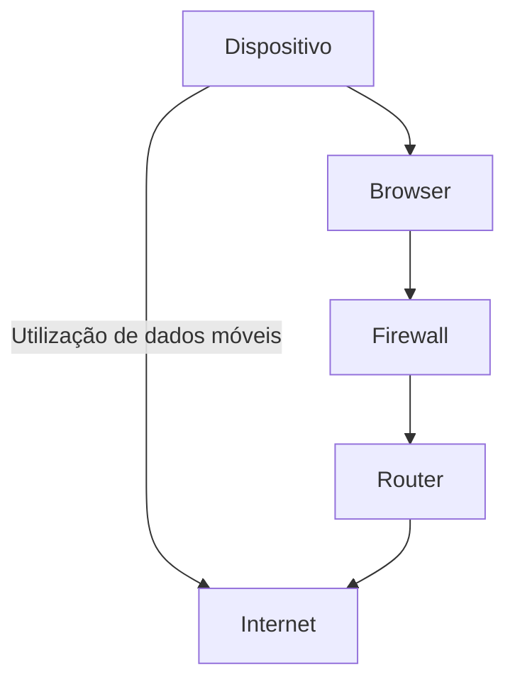

# Índice 

- [[#Introdução]]
- [[#Nível de ameaça]]
- [[#Recomendações basilares]]
- [[#Principais preocupações]]
	- [[#Email]]
	- [[#Passwords e verificação de 2 etapas]]
	- [[#Telemóvel]]
		- [[#Número de telemóvel]]
		- [[#Smartphones ]]
	- [[#Em quem confiar]]
	- [[#Encomendas - Compras online]]
	- [[#Redes sociais]]\
	- [[#Inteligência Artificial]]
- [[#Aplicações de comunicação online]]
- [[#Internet]]
	- [[#Em casa]]
	- [[#Dados móveis]]
	- [[#Hotspots]]
	- [[#Firewalls]]
- [[#Computadores]]
- [[# Engenharia social]]
	- [[#Phishing]]
	- [[#Formulários e websites]]
	- [[#Chamadas telefónicas]]
- [[#Códigos QR e outros formatos]]
- [[#Sistema bancário]]
- [[#Fotografias e metadados]]
- [[#Dispositivos Inteligentes - Internet das Coisas (IoT)]]
- [[#Browsers]]
- [[#VPNs]]
- [[#Conclusão]]
	- [[#Recursos adicionais]]

---
# Introdução

O mundo está cada vez mais inter-conectado e online. Para quem necessita ou quer garantir a sua privacidade e segurança, negligenciar o mundo digital não é uma opção, porém, manter o nível de segurança e privacidade desejado é um processo constante de decisão entre manter funcionalidades e automações de alguns serviços, ou em contraste, realizar alguns procedimentos manuais e não ter acesso às mesmas funcionalidades que algumas pessoas têm. Ciber-segurança é um mundo em evolução e uma fronteira importante para obter liberdade, privacidade e segurança pessoal. 

Neste artigo iremos falar sobre diferentes aspectos importante de ciber-segurança. Indicar os perigos envolvidos com algumas tecnologias e como estas podem ser utilizadas para propósitos maléficos. Iremos também abordar como prevenir que estas mesmas tecnologias sejam usadas para nos magoar ou aos que nos são próximos. 

O público-alvo deste artigo são vítimas de violência doméstica que desejam fugir aos seus agressores, ou que já tenham fugido e desejam manter o seu paradeiro desconhecido, contudo, a esmagadora maioria da população irá beneficiar dos conhecimentos partilhados neste artigo. 

É difícil dizer qual a ordem pela qual estas preocupações de ciber-segurança devem de ser abordadas, contudo o artigo está estruturado para que a ordem em que está escrito, com alguma lógica de seguimento técnico.

## Nota ao/a leitor/a

Numa edição anterior deste artigo, havia menções a ferramentas e técnicas específicas utilizadas para encontrar pessoas ou informações sobre elas, de modo a demonstrar o quão fácil era realizar estes atos de descoberta, contudo, tendo em consideração a temática deste artigo e a sua exposição, essas referências foram removidas de modo a não fornecer informação a um eventual abusador que encontre o artigo.

> [!info] O autor
> O autor trabalha na área de cibersegurança e escreveu o artigo de forma a que quem implemente as principais práticas sugeridas aqui, coseguirá "desparecer" online e esconder-se de pelo menos 95% das pessoas que possivelmente lhe queiram fazer mal. >Caso implemente a larga maioria das práticas, nem mesmo o autor e outras pessoas com capacidades ou conhecimentos semelhantes iriam ter a capacidade de encontrar a/o leitor sem ajuda profissional/governamental

# Nível de ameaça

Em ciber-segurança é costume definir [modelos de ameaça](https://www.privacyguides.org/en/basics/threat-modeling/) para tentar analisar o que é mais importante proteger. Isto porque é impossível manter sempre o anonimato, e garantir a privacidade e segurança em todos os momentos. Se alguém o tentasse fazer iria certamente gastar todo o seu tempo nesta atividade constante de análise e ação para ameaças que realisticamente serão infinitésimas.

Para criar o modelo de segurança e determinar o nível de ameaça em que estamos é necessário responder a estas perguntas:

1. **O que é que eu quero proteger?**
	1. A minha integridade física e mental
	2. A minha família
2. **De quem é que o quero proteger?**
	1. Abusadores
3. **Quão provável é que tenha mesmo que proteger o que decidi proteger?**
	1. Visto que com mais ou menos esforço, qualquer pessoa pode usar ferramentas disponíveis às massas, é quase certo que a necessidade é alta. Não queremos fazer assunções sobre a vontade e capacidade de um abusador. Devemos de tentar prevenir e dificultar o caminho a quem quer que nos queira fazer mal, de modo a que desistam e/ou não consigam.
4. **Quais serão as consequências se não conseguir proteger?**
	1. Violência física ou mental
	2. Roubo
	3. Morte ou rapto
5. **Qual o esforço que estou disposto a dispor para impedir as possíveis consequências?**
	1. Esta é geralmente a pergunta mais difícil de responder, especialmente quando uma pessoa não tenho conhecimento prévio suficiente da área para saber o esforço que uma decisão poderá implicar.
	2. Tendo em conta a dificuldade em encontrar ou fazer mal a alguém que siga as recomendações basilares, iremos trabalhar neste artigo sobre a presunção de que o esforço inicial necessário e algum cuidado e atenção contínua é todo o esforço necessário a que o leitor se dispõe a fazer.  

> [!warning] Auto determinação 
> O autor deste artigo faz alguma assunções sobre os perigos que o/a leitor/a pode correr, que podem não se adequar ao caso específico do/a leitor/a. É importante cada pessoa ponderar qual o seu modelo de ameaça, e com os conhecimentos que têm e que irá adquirir neste artigo, criar o seu próprio modelo.

# Recomendações basilares

Nos dias de hoje em países com um mínimo avanço tecnológico a vida das pessoas revolve à volta de duas principais tecnologias: *Telemóvel* e *Email*. Ao tomar alguns cuidados e fazer algumas alterações, a maior parte das pessoas consegue "desaparecer".

==Se não se fizer nada mais do que está indicado neste artigo, o mínimo deve ser:==
- Mudar de telemóvel;
- Separar as contas nas operadoras telefónicas e de internet das contas do abusador se for o caso de estarem juntas no momento em que a vitima procura fugir;
- Mudar de número de telemóvel;
- Criar um email totalmente novo sem nenhuma indicação de informação pessoal, por exemplo:
	- 123bi45@gmail.com (sem usar o número ou email antigo como factores de recuperação da conta)
- Eliminar o antigo email ou pelo menos eliminar todos os email que estejam na caixa de correio;
- Bloquear o abusador e qualquer pessoa que não se confie nas redes sociais;
- Tornar as contas nas redes sociais como contas privadas que não estão abertas ao público;
- Mudar as palavras-passes, números de telemóveis e emails em todos os serviços informáticos, para as novas versões;
- Usar um password manager como o [Bitwarden](https://bitwarden.com/)(recomendado) ou [LastPass](https://www.lastpass.com/pt) para criar palavras-passes fortes( múltiplos carácteres com símbolos e números) e as guardar;

> [!note] Nota
Neste artigo vai se falar de todos os tópicos mencionados nas recomendações basilares, explicar o porquê de serem necessárias, dentro do possível e sem dar ferramentas a agressores. Adicionalmente há algumas ferramentas de proteção/privacidade pessoal mencionadas durante o artigo

# Principais preocupações

Como mencionado previamente, no século XXI em países tecnologicamente avançados é quase impossível viver como uma pessoa sem telemóvel e email. É necessário email para serviços financeiros públicos, para o banco, para as comunicações com fornecedores de água e luz, e o mesmo se aplica para telemóvel. Tendo em conta a facilidade em obter informações pessoais, incluindo localização em tempo real de uma pessoa, estas tecnologias vão ser as nossas principais preocupação.

---
> [!Warning] Atenção
> Tentando ao máximo não partilhar mais informação do que o necessário. O computador/telemóvel da vítima(leitor/a) pode estar comprometido, e o abusador pode saber tudo o que a vítima faz no computador. Se o/a leitor/a acha ou sabe que alguém que lhe esteja a causar mal têm o mínimo conhecimento tecnológico, o autor recomenda formatar o seu computador e/ou telemóvel antes de seguir com os passos indicados neste artigo. Instruções podem ser encontradas aqui:
> 
> Formatar um computador MacOS: [Link](https://support.apple.com/en-us/102664)
> Formatar um computador Windows: [Link](https://support.microsoft.com/en-us/windows/give-your-pc-a-fresh-start-0ef73740-b927-549b-b7c9-e6f2b48d275e)
> Formatar um Iphone: [Link](https://support.apple.com/en-us/108931)
> Formatar um Android: [Link](https://support.google.com/android/answer/6088915?hl=en)
> 
> Ao formatar certifique-se que está a fazer uma limpeza total, isto significa não deixar nenhuma aplicação instalada nem nenhuma fotografia. Absolutamente nada, o computador/telemóvel deve de ser retornado ao base como se tivesse acabado de sair de fábrica.

---
## Email

O email é algo fácil de tratar e resolver, contudo, dependendo do número de contas associadas aos emails que o/a leitor/a poderá ter, pode ser um trabalho chato e demorado fazer a alteração do email associado a estas contas para o novo email.
O autor sugere alterar a palavra-passe dos emails atualmente utilizados para uma nova versão, e que **só depois deste acto**, se crie um novo email, com qualquer serviço de email que o/a leitor/a desejar, ou [Gmail](https://www.google.com/intl/pt-PT/gmail/about/), ou [Outlook](https://www.microsoft.com/pt-pt/microsoft-365/outlook/email-and-calendar-software-microsoft-outlook) ou ainda o mais seguro destes: [Protonmail](https://proton.me/pt/mail).

O email deve de ser algo banal que não indique quaisquer informações sobre nós: 123bi45@gmail.com.

Após criar o email novo, o autor recomenda a instalação e utilização de um gestor de palavras-passes e que se use este para guardar e gerar novas palavras-passes. Nunca se deve de guardar credenciais de acesso num papel ou num documento de texto no computador, nem também num serviço como o password manager do Google Chrome ou Firefox.

## Passwords e verificação de 2 etapas

A forma mais fácil de memorizar palavras-passes é não ter que as memorizar de todo. Existem ferramentas incrivelmente seguras que tratam de tudo por nós, como por exemplo: [Bitwarden](https://bitwarden.com/help/getting-started-webvault/)(grátis e de bastante confiança)

Após criar um novo email, é recomendado criar uma conta no Bitwarden e começar a usar o mesmo para gerar palavras-passes, as quais podemos depois utilizar no registo de contas ou atualização de contas. 

![[Pasted image 20240517183125.png | 250]]

Se o/a leitor/a decidir utilizar o Bitwarden como um [plug-in no Browser](https://bitwarden.com/help/getting-started-browserext/)(imagem acima), irá simplificar a sua vida, pois o mesmo detecta quando estão a ser introduzidas credenciais de acesso(username e password) e vai perguntar ao utilizador se deseja guardar estas informações no cofre do Bitwarden, ao qual se deve indicar que sim:

![[Pasted image 20240517183608.png]]

Adicionalmente ==é altamente recomendado que o/a leitor/a utilize autenticação de 2 etapas em todos os serviços que assim o permitirem==. [Autenticação de 2 etapas](https://www.microsoft.com/en-us/security/business/security-101/what-is-two-factor-authentication-2fa) é apenas uma forma de verificar que quem está a utilizar um serviço é mesmo a/o dona/o da conta. 
**Por exemplo:** Ao fazer login no Gmail num dispositivo(telemóvel) novo, será enviado uma mensagem para o número do dono da conta para que o mesmo autorize o login, comprovando assim que é o dono da conta que está a tentar fazer login.

É possível fazer autenticação de 2 etapas com o número de telemóvel ao receber mensagens com um código para ser introduzido no serviço. Contudo, o autor recomenda que se utilize aplicações feitas com este propósito, como por exemplo a [Authy](https://authy.com/), pois o [número de telemóvel pode ser usurpado](https://www.incognia.com/the-authentication-reference/what-is-sim-swap-attack-and-why-fast-detection-is-important), e as mensagens de SMS não são encriptadas, o que facilita a leitura das mesmas sem ser preciso nenhuma credencial.

## Telemóvel

**O telemóvel deve sempre ser trocado se houver meios financeiros para tal.** 

Há muitas formas de rastrear um telemóvel sem que a/o proprietária/o se aperceba.
Existem serviços online e identificadores únicos que permitem os telemóveis serem localizados - os quais o autor não irá indicar ou partilhar. Estas funcionalidades e aplicações semelhantes podem ser ativadas sem o/a utilizador/a do telemóvel se aperceber, e por isso será sempre melhor trocar de telemóvel. Não sendo possível trocar de telemóvel, o telemóvel deve de ser formatado como previamente indicado no início da secção: [[#Principais preocupações]]. 

```ad-tip
title: Telemóveis e cartões SIM novos
Caso seja possível arranjar um telemóvel e/ou cartão SIM novo, é preferível que o mesmo seja comprado com dinheiro e não através de uma transação digital de modo a impedir que o mesmo seja conhecido e possivelmente se saiba o IMEI do novo telemóvel.

Se a/o leitor for a uma loja de telemóveis facilmente poderá encontrar um telemóvel bastante barato por menos de 50€ e o mesmo se aplica a um cartão SIM. Adicionalmente, deve de se comunicar com a operadora telefónica, que para se poder pedir um novo SIM card fisíco deve de ser resposta de segurança, como por exemplo: "Qual o nome do cão do meu vizinho no secundário"
```

### Número de telemóvel

Existem ferramentas que permitem fazer pesquisas de contas em redes sociais e muitas outras plataformas através de números de telemóvel, que infelizmente, são muitas vezes necessários para criar uma conta num serviço online.
Se o número de telemóvel for conhecido por parte de quem têm más intenções para connosco ou quem nos é próximo, também poderá usar este meio de comunicação como uma fonte de constante perturbação/assédio ao fazer telefonemas constantes, ao registar o nosso número em serviços que não usamos entre outros entre muitas outras formas.

==É recomendado que para o nosso número final, se crie uma nova conta com uma operadora telefónica com um email do qual o nosso abusador não tenha conhecimento e que este número só seja partilhado com as pessoas que são 100% de confiança==. Se for possível que o cartão SIM seja um cartão virtual([eSIM](https://www.vodafone.pt/telemoveis/esim.html)) tanto melhor, pois não irá necessitar de esperar que o cartão seja enviado por correio ou de ter que ir a algum  local fisicamente buscar o cartão, reduzindo assim a sua exposição.

### Smartphones

Os smartphones são uma ferramenta incrivelmente útil tendo funcionalidades de GPS, Internet e fotografia. Contudo estas funcionalidades também podem ser usadas contra nós se não tivermos cuidado. É inteiramente possível alguém utilizar um smartphone e ter um bom nível de privacidade e anonimato ao seguir as indicações feitas ao longo deste artigo e possivelmente. Se a/o leitor/a tiver conhecimentos técnicos suficientes, ou quiser experimentar, pode utilizar Sistemas Operativos mais seguros no seu smartphone. Para ver uma lista destes Sistemas Operativos e como os instalar, pode ver [aqui](https://www.privacyguides.org/en/android/)

O autor deste artigo não recomenda mudar o Sistema Operativo do telemóvel a todas as pessoas. Contudo, se alguém sentir a necessidade de se proteger e têm receio de utilizar serviços como GPS ou internet, o mais fácil e recomendado seria comprar um telemóvel sem estas capacidades, como por exemplo:


![[Pasted image 20240517175846.png#center |256]]

Geralmente um telemóvel que custe menos de 50€ não irá ter funcionalidades de GPS. Telemóveis [Nokia baratos](https://www.hmd.com/pt_pt/nokia-105?sku=1GF019CPA2L12) são geralmente uma ótima opção.

> [!note] Nota
>  Mais recursos sobre privacidade e segurança para Iphones e Android pode ser visto aqui: [Link](https://www.youtube.com/watch?v=mzI0s7G6yJE)


## Em quem confiar

==A triste realidade é que confiar em alguém será sempre uma aposta com potencial para ter resultados negativos, não necessariamente por malícia mas muitas vezes por falta de cuidado.==
Imaginemos uma situação em que tiramos uma foto a uma paisagem que vemos da nossa janela e a partilhamos com alguém através do Whatsapp. Há situações em que essa mesma foto pode chegar às mãos de um predador/abusador, quer seja partilha acidental da imagem com terceiros, ou a pessoa com que partilhamos a foto tenha o seu telemóvel infectado com software de espionagem que reencaminha as mensagens para o abusador automaticamente. Existem dezenas de formas de obter acesso a informações nos telemóveis de outra pessoa. 
Adicionalmente a imagem pode conter [metadados](https://www.metadados.pt/oquesaometadados/) com latitude e longitude, indicando a localização exata de onde a foto foi tirada. Isto acontece muitas vezes quando uma pessoa tem o GPS ativado no momento em que tira a foto, e nunca se deu ao trabalho de bloquear esta funcionalidade no seu telemóvel. Adicionalmente, a própria imagem pode contar muita informação visual que pode indicar facilmente a nossa localização.

==**Conclusão**:== Podemos e devemos confiar em pessoas. Somos seres sociais que precisamos de comunicar e prosperamos em grande parte devido a nossa vivência em sociedade. Contudo, podemos e devemos também ser cuidadosos/as, o que na realidade implica não partilhar informação desnecessária e termos noção da informação que partilhamos quando a estamos a partilhar, isto pode incluir fotografias, vídeos, mensagens de voz, e mesmo o que se diz. 

```ad-info
title: Automação
Este artigo apresenta algumas ferramentas que simplificam a vida e aumentam a nossa segurança e privacidade, como [[#VPNs]] e gerenciadores de palavras-passes. Ferramentas como estas e outras reduzidem a possibilidade de partilhar informação perigosa mesmo que por acidente.
```

## Encomendas - Compras online

É recomendado que não se mande vir encomendas para a nossa morada, mas sim para um ponto de recolha de encomendas. Desta forma não necessitamos de partilhar a nossa morada com outras pessoas ou serviços que não controlamos e podemos ir buscar as encomendas quando acharmos mais seguro e cómodo. 

## Redes Sociais

As redes sociais para quem têm como objetivos investigar pessoas e obter informações privadas são uma fonte de informação sagrada. É genuinamente fácil obter a localização e outras informações através das redes sociais. 

O autor pede ao leitor/a confiança nesta afirmação ao saber que previamente o autor mencionava formas de o fazer de modo a demonstrar a facilidade de o fazer, porém, com mais cuidado e atenção ao tópico em questão estas menções foram removidas.

Com isto em mente, o/a leitor/a pode seguir alguns destes passos, dependendo do seu modelo de ameaça, de modo a reduzir a sua exposição online:
1. Eliminar todas as redes sociais
	1. É uma passo extremista e está dependente da preocupação do/a leitor/a. Contudo é de notar que é  inteiramente possível ter contas em redes sociais, especialmente se criar uma conta nova e seguir os restantes conselhos.
2. Tornar os perfis privados e/ou escolher quem queremos dar permissão para interagir com as nossas contas nas redes sociais.
	1. Tornar o [instagram privado](https://help.instagram.com/448523408565555)
	2. Tornar o [facebook privado](https://www.facebook.com/help/193677450678703)
	3. Tornar o [twitter privado](https://statusbrew.com/insights/how-to-make-twitter-account-private/)
	4. Quase todas as redes sociais têm ferramentas que permitem limitar quem pode ver e interagir com as nossas contas, é uma questão de procurar nos motores de pesquisa(Google ou Bing) como fazer.
3. Não meter fotos das nossas caras como fotos de perfil.
4. Não meter localização nos posts.
5. Não partilhar fotos ou informação sobre a nossa residência ou de quem nos é importante.
6. Bloquear pessoas problemáticas ou em que não se confia.
7. Certificar que ninguém partilha fotos nossas ou que nos identificam em posts nas redes sociais sem a nossa expressa permissão. O Instagram por exemplo, permite que se alguém nos quiser identificar numa foto, nós teremos que aprovar esse pedido de identificação.
8. Se estivermos a viajar ou a passear, nunca partilhar as fotos assim que as tiramos. Idealmente só quando se terminar a viagem ou se estiver noutra cidade/região é que se deve partilhar as fotos.

## Inteligência Artificial

O avanço da tecnologia pode ser bastante positivo para a humanidade, porém, para todos os avanços existem efeitos secundários.
Com todos os cuidados possíveis e sem indicar ferramentas ou expor ideias a pessoas mal intencionadas, o autor recomenda expressamente que o/a leitor/a defina frases com as pessoas mais próximas de si para garantir a autenticidade da pessoa em questão.

**Exemplo:** 
> Alguém nos telefona através do Whatsapp em vídeo chamada a partir de um número que não temos registado no nosso telemóvel. Ao atender a chamada podemos ver que é um familiar e que têm a mesma voz, estão em pânico a dizer que estão a ser perseguidos e que precisam de ajuda, pedem para enviar a nossa morada para se encontrarem connosco e estarem seguros. 

Esta situação apesar de preocupante e stressante, é uma situação criada para nos fazer partilhar informação ou realizar alguma ação que nos prejudica a nós. Se tivermos uma frase ou palavra-passe que a pessoa em questão têm que dizer para garantir que é quem diz ser, estamos a certificarmo-nos de quem ninguém corre mais riscos do que os necessários.


# Aplicações de comunicação online

Existem aplicações de comunicação online mais seguras do que outras e apesar de não ser o ponto de maior preocupação para vitimas que desejem fugir dos seus agressores, não deixa de ser um área de vulnerabilidade para as vítimas.

**Recomendações**
- Grande parte das informações previamente partilhadas aplicam-se a este ponto também, especialmente a secção relativa a [[#Redes Sociais]].
- Não usar redes sociais e aplicações de comunicação online como Whatsapp ou Messenger para partilhar informações, quer sejam estas relativas à situação de abuso ou a informações sobre a vítima, pois o/a abusador/a pode ter acesso às contas sem a vitima o saber e as aplicações não são seguras.
- Aplicações recomendadas: [Signal](https://signal.org/) e [Keybase](https://keybase.io/download)
	- Ambas as aplicações encriptam as mensagens de ponta a ponta, certificando assim que mesmo quem esteja a registar o tráfico na internet não consiga ler as mensagens. Adicionalmente ambas as aplicações permitem definir um limite máximo de visualização para as mensagens, após o qual nenhum dos membros da conversa poderá ver as mensagens. 
	- Telegram não é recomendado pelo autor porém, para entender melhor o porquê, o/a leitor/a pode ver este vídeo: [Link](https://www.youtube.com/watch?v=rtRQKQkvUfE)
	- Se o/a leitor/a quiser melhor o nível de segurança do Signal pode adicionalmente seguir os passos indicados neste vídeo: [Link](https://www.youtube.com/watch?v=DPjg3651oJM)
	- A recomendação principal é o **Signal**

# Internet

A internet não é nada mais do que uma das muitas redes de computadores que existem no planeta. Há muitas coisas boas na internet, porém também existem muitos problemas e riscos que uma pessoa acarreta simplesmente ao utilizar a internet, alguns dos quais já foram abordados. Contudo a experiência de utilizar a internet pode ser muito mais segura e privada sem se perder a facilidade de acesso à mesma.

Geralmente o acesso à internet segue este esquema:

**Nota:** O dispositivo neste caso pode ser muitas coisas, mas geralmente será o telemóvel ou o computador.


O maior ponto de preocupação para o cidadão comum que não esteja a lidar com nenhum hacker com conhecimento técnico, ou cidadão que seja algum dissidente político ou até jornalista serão os [[#Browsers]]. Adicionalmente há algumas preocupações que poderão ser tomadas de modo a aumentar a segurança e privacidade da navegação na internet como [[#VPNs]], [[#Firewalls]] e serviços de DNS especializados em segurança e privacidade como: [NextDNS](https://nextdns.io/) e [quad9](https://quad9.net/) 

```ad-note
title: Nota
No diagrama foi feita uma simplificação muito grande relativamente ao acesso à internet apenas com o intuito de simplificar e ilustrar os pontos de acesso e comunicação.
```

## Em casa

Se vive com alguém em que não confia, a recomendação mais fácil e inteligente é não fazer pesquisas nem ter conversas sobre este tipo de conteúdos na sua casa.

Existem muitas métodos de monitorizar todo o tráfego que passa na rede de casa. Métodos estes que não serão ilustrados ou indicados neste artigo

## Dados móveis

Dados móveis são uma ótima forma de escapar aos possíveis perigos de utilizar uma rede sobre a qual não se detém o controlo - de facto é a recomendação do autor para estas vítimas - contudo existe um pormenor a ter em atenção.

É inteiramente possível que se ainda não se tiver conseguido realizar as acções recomendadas na secção relativa ao [[#Telemóvel]] que o criminoso que procura controlar a vítima, possa pedir à operadora de telecomunicações para obter toda a informação do tráfego na internet e saber quase tudo o que foi feito na internet.

## Hotspots

Hotspots ou dito de outra forma: "Redes que o utilizador não controla" são incrivelmente inseguras. A recomendação é **NUNCA** ligar a uma rede que não se controla e não seja de confiança. 

Os riscos são demasiados e inclusive, são indiferentes à pessoa que se conecta à rede e se a rede é detida por um criminoso ou não. Se a rede é pública, pode facilmente ser comprometida e facilmente roubar-se informações bancárias ou de credenciais usadas para aceder a websites como Facebook, Gmail entre muitos outros.

## Firewalls

Firewalls são essencialmente portas de segurança pelas quais a comunicação entre um dispositivo e a internet têm que se passar se o dispositivo tiver uma Firewall ligada.
As Firewalls são apenas regras de segurança que a comunicação que entra e sai do dispositivo têm que respeitar, e as regras podem ser modificadas de acordo com as necessidades do utilizador do dispositivo.

Para ativar a firewall num computador Windows pode seguir os passos aqui indicados:
- [Turn on your Windows Defender Firewall ](https://learn.microsoft.com/en-us/mem/intune/user-help/you-need-to-enable-defender-firewall-windows)
Para ativar num computador Mac:
- [Ativar a proteção por Firewall](https://support.apple.com/pt-pt/guide/mac-help/mh34041/mac)
Para telemóveis Iphone ou Android, a recomendação é utilizar a aplicação da [Quad9](https://quad9.net/support/set-up-guides) para obter o mesmo efeito de uma firewall.

```ad-tip
title: Firewalls podem ser utilizadas em conjunto com outros serviços
Firewalls são uma última linha de defesa para o tráfego que entra e sai dos nossos dispositivos. Podem ser combinados com tecnologias como DNSSEC, blocklists e VPNS
```

# Computadores

Computadores são instrumentos caros e nem todos podemos ter acesso a um, porém, quem têm, deve de ter conhecimento destes traços gerais relativos a privacidade e segurança.

1. Existem múltiplos sistemas operativos e nem todos são iguais, há alguns mais rápidos e seguros do que outros, na sua generalidade, entre os mais populares, em ordem decrescente estes são os mais seguros:
	1. Linux
	2. MacOS
	3. Windows
2. Nenhum computador é completamente seguro e algumas precauções devem de ser tomadas:
	1. Certificar que é necessário palavras-passes para aceder ao computador.
	2. Não usar ou fazer download de aplicações ou ficheiros dos quais não se conhece a origem ou se confia.
	3. Usar uma VPN.
	4. Usar uma firewall.
	5. Certificar de que é preciso autorização para permitir que dispositivos eletrónicos se liguem ao computador, por exemplo em MacOS: [Link](https://support.apple.com/en-gb/guide/mac-help/mchlf779ae93/mac)
		1. Razão pela qual se deve de ter muito cuidado com o que permitimos conectar fisicamente ao computador: [Link](https://www.amazon.com/ZWIZX-Password-Windows-Recovery-Bootable/dp/B093B4XKPT/ref=sr_1_3?dib=eyJ2IjoiMSJ9.N7sqbnjqux2Fe0YWxLeCyWhB4j_NMHVF2oiMGcG2fVLeRNfvtDzNs_ZVmL70nIiBCYvBy0EZi2NpwIgmsXQdQyAthCHawdPmnfbAM1EwMcIAipoVAQSaDg3O6nDbGnYtGJRiaLWVEsgj3hJe5szjuLNuW56wCWB8ETHHWL4lkJSIGqX3R6CDmLFiNXduQP2kwIDSG1_ZWcqnC--JVzXXZuNV-EYf9MLU3JWBj5pEIx8.t_XjgmEgVOsXjeHeeyEPi2iYQ87WciQahCxaPA9XGpA&dib_tag=se&keywords=password+reset+usb&qid=1717193044&sr=8-3) 
# Engenharia social

Na sua generalidade o aspecto mais vulneravel de um sistema é o aspecto humano. Somos nós que cometemos os erros mais impactantes, e exatamente por isso devemos de ter atenção ao usar a internet. 

Vídeo sobre o poder de engenharia social: [Hacking challenge at DEFCON](https://www.youtube.com/watch?v=fHhNWAKw0bY)

Em geral uma pessoa ira impedir este tipo de ataque se tomar atenção aos seguintes pontos:
1. Email
		1. Já troquei emails com este contacto anteriormente?
		2. O domínio é legítimo?
			1. **googlle.com** é muito parecido a **google.com** mas o mais certo é ser alguém a tentar personificar a empresa Google.
		3. Quem me enviou o email está me a pedir alguma informação que já deveria de ter? (Morada, cartão de cidadão, número de telemóvel, cartão bancário)
		4. O email está bem escrito?
		5. Tem links para eu carregar? Existem ferramentas para validar se o link será possivelmente malicioso: [NordVPN link checker](https://nordvpn.com/link-checker/)
2. Número de telemóvel
		1. É a primeira vez que estou a comunicar com este contacto?
		2. O número é do mesmo país que eu? (+351 para Portugal)
		3. Quem me enviou o email está me a pedir alguma informação que já deveria de ter? (Morada, cartão de cidadão, número de telemóvel, cartão bancário)

## Phishing

Phishing é um crime que consiste em enganar as pessoas de modo a partilharem informações confidenciais ao impersonificar alguém de importância para a vítima.
Um método muito comum de praticar ataques de phishing é através de emails em que o autor do crime, se faz passar por alguma entidade que não é, por exemplo:

![[Pasted image 20240605150914.png]]


## Formulários e websites

É muito fácil criar formulários hoje em dia com ferramentas como o [Google Forms](https://www.google.com/forms/about/), da mesma forma que devemos sempre ter sempre atenção aos emails e números de telemóvel que nos contactam, devemos ter a mesma atenção a formulários e websites.

Os formulários podem ter sido criados por pessoas com más intenções e mais uma vez, devemos sempre ter atenção às informações que nos estão a pedir e à origem do formulário.

O mesmo rigor e higiene eletrónico deve ser mantido quando se está a procurar aceder a um website. Uma forma bastante comum de tentar enganar as pessoas na internet, é criar websites que são cópias de um outro website legitimo mas que pertence a alguém com más intenções. Por exemplo temos 2 websites iguais mas o link/domínio dos websites são diferentes: https://www.gcd.pt em vez https://www.cgd.pt 

# Códigos QR e outros formatos

Códigos QR e outros formatos semelhantes, são apenas formas visuais de guardar informação. Até analisar o código QR não sabemos o que é que ele contém, e só o acto de analisar pode ser perigoso. Se for um link malicioso e usarmos uma aplicação num telemóvel que abre automaticamente o link, podemos estar automaticamente comprometidos.

Restaurantes modernos têm muitas vezes este códigos QR como links para o seu menu digital, mas alguém poderá ter colado um código QR por cima do código do restaurante. A solução óbvia é pedir o menu em papel.

A recomendação mais fácil e de resolução imediata é não analisar estes códigos se possível. 

![[Pasted image 20240605153146.png]]

# Sistema bancário

O sistema bancário é por norma bastante seguro, contudo, é possível nós como usuários fazermos asneiras ou partilharmos mais informação do que necessário e ser usado contra nós.

Para quem se deseja manter escondido/a ou anónimo/a, a solução mais fácil é levantar dinheiro num multibanco e fazer pagamentos com dinheiro físico, deste modo não há registo eletrónico de onde foi gasto o dinheiro. Para quem ainda não se tiver conseguido separar do seu agressor, se houver registos eletrónicos de onde alguém gastou dinheiro, isso pode ser uma forma de saber a localização.

Relativamente a compras online, é sugerido criar cartões temporários com aplicações como o MBWay por exemplo.

# Fotografias e metadados

Todos os ficheiros hoje em dia contém [metadados](https://www.metadados.pt/oquesaometadados/)(dados sobre outros dados). Estes dados são muito úteis para sistemas informáticos, contudo, muitas vezes os ficheiros contém metadados a mais e perigosos de para quem se quer manter anónimo ou esconder.

Metadados de fotografias por exemplo, contém muitas vezes a localização e data em que uma foto foi criada. Estes dados facilmente são extraídos, mesmo por quem não tem conhecimentos técnicos através de ferramentas como a [pic2map.com](https://www.pic2map.com/)

Exemplo dos dados:

```sh
> mdls gps/DSCN0021.jpg | rg -i '(date|latitude|longitude)'
kMDItemContentCreationDate         = 2008-10-22 15:38:20 +0000
kMDItemContentModificationDate     = 2008-10-22 15:38:20 +0000
kMDItemGPSDateStamp                = "2008:10:23"
kMDItemLatitude                    = 43.46708166666667
kMDItemLongitude                   = 11.88453833333333
```

Devemos de desativar estas funcionalidades sempre que possível.
Instruções neste link: [Definições para câmeras fotografia Android](https://support.google.com/photos/answer/9921876?hl=en#zippy=)

# Dispositivos Inteligentes - Internet das Coisas (IoT)

Existe um ditado que diz que o "S" em "IoT" representa Segurança. 
Segurança e privacidade não são, nem nunca foram uma preocupação na área de IoT, e certificar de que estes dispositivos/sistemas são seguros requere bastante conhecimento técnico e trabalho.
A forma mais fácil de garantir a sua segurança e privacidade é garantir que não usa nenhum dispositivo ou sistema destes.

Estes dispositivos podem ser:
	- Cameras de vigilância
	- Fechaduras elétricas
	- Monitores de bebés
	- Extensores de rede

```ad-attention
title: Atenção
Esta secção é muito importante, porém, para conseguir certificar que os pontos mencionados são bem implementados é necessário bastante conhecimento técnico. Se não detém este conhecimento, ou não conhece ninguém de confiança que os consiga implementar, **a recomendação do autor é mesmo não usar dispostivos inteligentes**.
```

**Contudo se for uma necessidade**(provavelmente não será), o utilizador deve saber que  certificar que dispositivos IoT são seguros é das preocupações mais difíceis de alcançar, dito isto, aqui ficam alguns pontos introdutórios :
1. Os dispositivos não estão acessíveis através da internet. Só devem de ser acessíveis se o usuário estiver na mesma rede que o dispositivo(em casa).
	1. Idealmente estes dispositivos devem de estar isolados numa [VLAN](https://www.controle.net/faq/o-que-e-para-que-serve-uma-vlan) que não está expostas à rede pública.
2. É preciso uma palavra-passe para aceder ao dispositivo.
3. Os serviços usam encriptação moderna.
4. Que o software é atualizado com regularidade
5. Idealmente que o software que corre nos dispositivos seja open-source e que ainda tenha atualizações

# Browsers

Já foi mencionado que os Browsers são um dos pontos de ataque mais vulneráveis de qualquer computador/telemóvel. Existem muitas razões para este ser o caso, desde o facto de um browser correr código em tempo real, ou da ligação inerente à internet e até mesmo a linguagem de programação utilizada para desenvolver os browsers. Tendo isto em conta, devemos de dedicar algum tempo a certificar que o Browser que usamos é seguro.

Esta é uma das áreas de resolução mais imediata, basta utilizar qualquer um dos seguintes browsers:
- [Brave](https://brave.com/)
- [Firefox](https://www.mozilla.org/pt-PT/firefox/new/)
	- É recomendado melhorar a segurança do Firefox ao seguir as instruções [aqui](prehistoric shark) indicadas 
- [Librewolf](https://librewolf.net/)
- [Mullvard browser](https://mullvad.net/pt/browser)

Todos estes browsers têm versões para IoS e Android que também devem ser usadas.
Estes browsers são mais seguros por natureza devido à forma como são desenvolvidos e a preocupação de segurança e privacidade base na criação dos mesmos. Se quiser ver uma comparação entre alguns browsers modernos, pode visitar este link: [privacytests.org](https://privacytests.org/)

Adicionalmente, deve sempre adicionar este plugin ao seu browser(se não tiver o seu browser fortificado):
- [uBlock origin](https://addons.mozilla.org/en-US/firefox/addon/ublock-origin/?utm_source=addons.mozilla.org&utm_medium=referral&utm_content=search)
	- Um bloqueador de anúncios. Alguns ciber-ataques tentam utilizar anúncios para  correr código malicioso nas máquinas dos utilizadores

# VPNs

VPNs são uma componente importante para garantir a privacidade e também a sua segurança ao navegar na internet, pois, estes serviços encriptam parcialmente os seus dados enquanto está a navegar a internet, adicionalmente, alteram a localização aparente de um cliente que use uma VPN. 

Antes de ativar a VPN:
![[Pasted image 20240606004958.png]]
Após ligar a VPN:
![[Pasted image 20240606005209.png]]

VPNs em conjunto com o uso dos [[#Browsers]] recomendados e as precauções mencionadas na secção da [[#Internet]] e [[#Computadores]], aumentam exponencialmente a sua segurança e privacidade ao navegar na internet.


# Conclusão 

 Há pessoas que fazem da sua vida investigar pessoas e organizações, tal como existem pessoas que utilizam todas as suas capacidades para manter o anonimato. Esta é uma área bastante dinâmica com muitos pontos a considerar como o/a leitor/a pode observar ao longo deste artigo, contudo, se o/a leitor/a implementar as recomendações descritas neste artigo, estará mais seguro/a do que 99.5% das pessoas que usam computadores e telemóveis. 
 Seria preciso uma pessoa com bastantes capacidades e criatividade para conseguir 

---
## Recursos adicionais
Se desejar continuar a aprender mais sobre o mundo de cibersegurança e privacidade, na perspectiva de usuário, pode investigar estes links:

- Listas e indicações de segurança:
	- [Privacy guides](https://www.privacyguides.org/en/)
	- [Privacy guides forum](https://www.reddit.com/r/PrivacyGuides/)
	- [Privacy tools](https://www.privacytools.io/)
	- [Awesome privacy](https://github.com/Lissy93/awesome-privacy)
	- [Another awesome privacy](https://github.com/pluja/awesome-privacy)
	- [Privacy is sexy](https://github.com/undergroundwires/privacy.sexy)
	- [Privacy list from humane tech group](https://codeberg.org/teaserbot-labs/delightful-humane-design#privacy)
	- [Personal security checklist](https://github.com/Lissy93/personal-security-checklist)
- Canais de youtube:
	- [Techlore youtube channel](https://www.youtube.com/@techlore)
	- [Naomi Brockwell TV youtube channel](https://www.youtube.com/@NaomiBrockwellTV)
	- [Mental outlaw youtube channel](https://www.youtube.com/@MentalOutlaw)
- Windows:
	- [Windows optimizer](https://github.com/hellzerg/optimizer)
	- [Atlas the windows modifier](https://github.com/Atlas-OS/Atlas)
	- [Privacy and security check for windows](https://github.com/builtbybel/privatezilla)
- Android:
	- [Android app manager without root access](https://github.com/aistra0528/Hail
	- [Android debloater](https://github.com/0x192/universal-android-debloater)
	- [Another android debloater](https://github.com/Universal-Debloater-Alliance/universal-android-debloater-next-generation)
- MacOS:
	- [MacOs security & privacy guidelines](https://github.com/drduh/macOS-Security-and-Privacy-Guide)
- Degooglefy and self-hosting:
	- [Self-hosting resources](https://github.com/awesome-selfhosted/awesome-selfhosted)
	- [Self-hosting guides](https://github.com/mikeroyal/Self-Hosting-Guide)
	- - [Degoogle your life](https://github.com/tycrek/degoogle)

